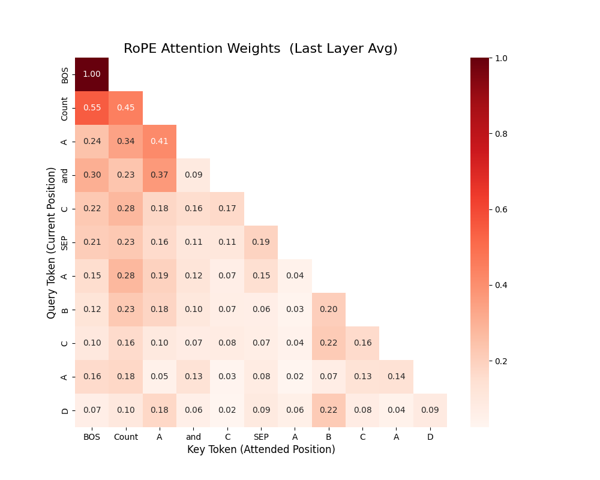
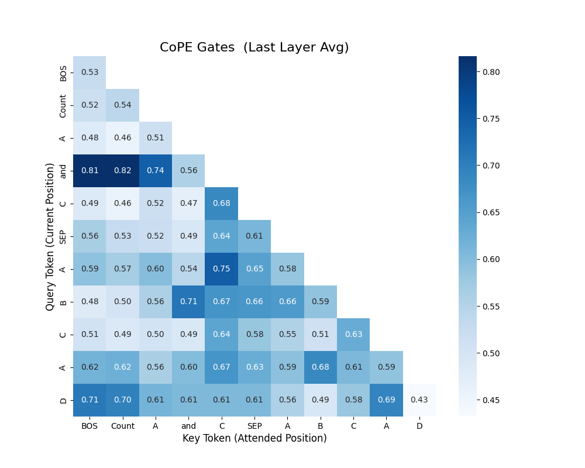

# CoPE vs RoPE: 上下文位置编码的对决

[](https://arxiv.org/abs/2405.18719
        
        )
[](https://pytorch.org/get-started/locally/)
[](LICENSE)

本项目是对 Meta AI 2024 年论文 **《Contextual Position Encoding: Learning to Count What’s Important》** 的深度技术复现与评估。我们通过高难度的“选择性计数任务”，对比了 **CoPE** (Contextual Position Encoding) 与主流的 **RoPE** (Rotary Position Embedding) 在逻辑拟合与长度外推上的表现。

---

## 📖 核心原理 (Mechanisms)

### CoPE: 动态上下文计数
与固定位置索引不同，CoPE 认为位置应该是“语义化的”。它通过注意力门的累积和（CumSum）来动态计算 Token 之间的距离，从而能够自动忽略序列中的“无关噪声”。

### RoPE: 旋转位置编码
RoPE 通过在复数空间旋转向量来捕捉相对位置。它在现代 LLM（如 Llama, Mistral）中被广泛使用，但在处理需要跳过特定上下文的计数任务时，往往依赖于模型的参数拟合而非结构特性。

---

## 🧪 实验设计: 选择性计数 (Selective Counting)

我们设计了极具挑战性的 **"Hard Mode"**：
*   **格式**: `Count {A} and {C}` [指令区] | `A B C C A D B ...` [内容区]
*   **逻辑**: 模型必须根据开头的动态指令，仅对指定类别的 Token 进行计数叠加。
*   **外推测试**: 在 $L=1024$ 的长度下训练，在 $2L=2048$ 的长度下测试。

### 核心指标对比

| 模型 | 1024 (In-Domain) | 2048 (Extrapolation) | 计算开销 |
| :--- | :--- | :--- | :--- |
| **RoPE (Aligned)** | 93.20% | 45.20% (Fail) | 低 ($$O(T)$$) |
| **CoPE (Paper Ver)** | **94.80%** | **45.60% (Fail)** | 高 ($$O(T^2)$$) |

> [!NOTE]
> **结论**: 在论文原版实现下，CoPE 在处理复杂逻辑时具有更强的拟合能力（反超 RoPE），但目前的零样本外推（Zero-shot Extrapolation）对两者而言依然是巨大挑战。

---

## 🎨 可视化解读

### 1. RoPE: 局部关注模式
RoPE 表现出典型的注意力局部性，无法显式过滤干扰词。


### 2. CoPE: 语义门控模式 (Winner)
CoPE 学习到了动态的门控逻辑：它会主动关注指令区，并尝试在计算位置时“跳过”无关 Token。


---

## �️ 项目结构与运行

### 环境准备
```bash
source /home/ubuntu/miniconda3/bin/activate CoPE
pip install -r requirements.txt
```

### 快速启动
```bash
# 同时启动 RoPE 和 CoPE 训练 (需双卡)
bash scripts/train/run_train.sh

# 自动评估外推准确率
bash scripts/eval/run_eval.sh

# 生成注意力热力图
python scripts/eval/visualize.py --config configs/cope_selective.yaml --ckpt_path outputs/cope_selective/ckpt_latest.pt
```

## 📂 目录说明
*   `src/`: 核心模块 (CoPE 门控、Transformer 模型、数据生成器)
*   `configs/`: 实验超参数 (YAML 格式)
*   `scripts/`: 训练与评估脚本 (包含 Shell 一键运行)
*   `outputs/`: 实验结果与可视化图像

---

## 🔗 参考资料
*   论文: [Contextual Position Encoding: Learning to Count What’s Important](https://arxiv.org/abs/2405.18719)
*   作者: Golkar et al. (Meta AI, 2024)

---
*本项目代码包含详细的中文注释，旨在为研究位置编码的开发者提供直观的参考。*
